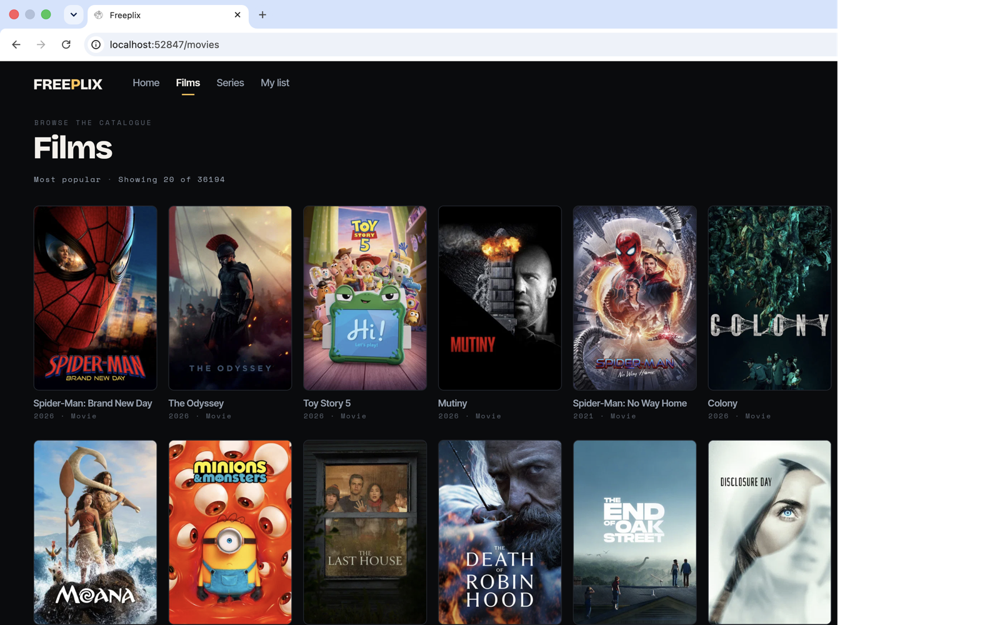
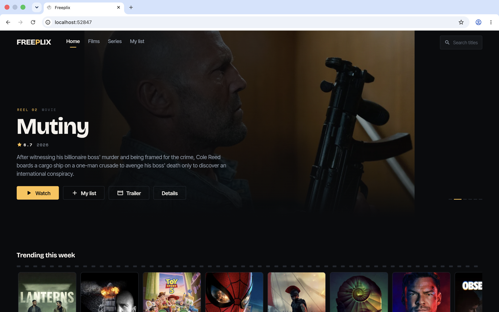
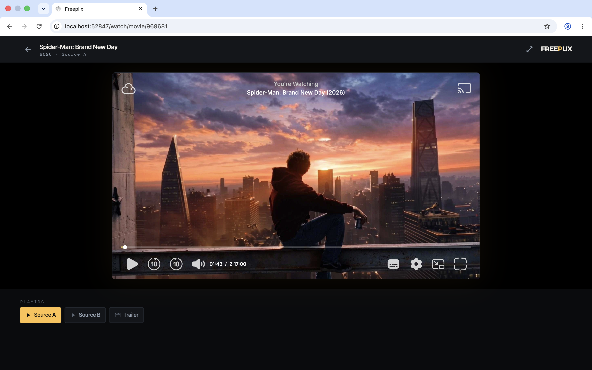
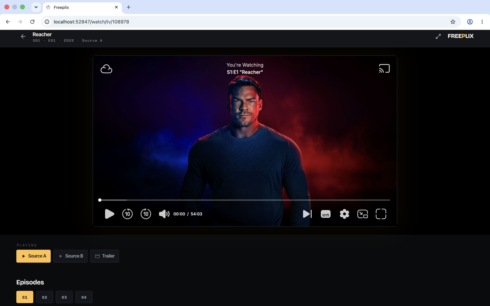
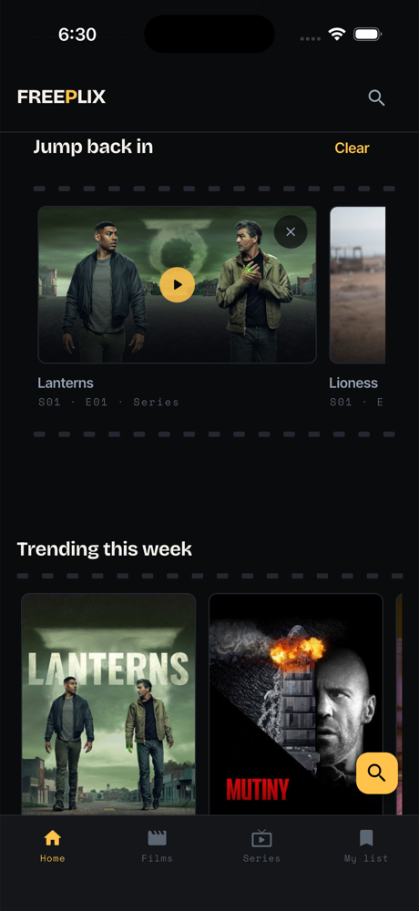
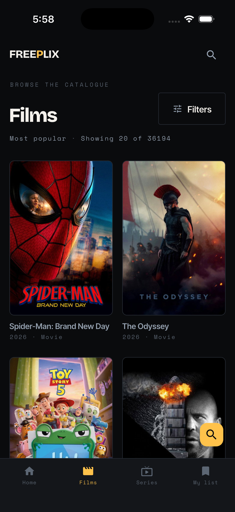
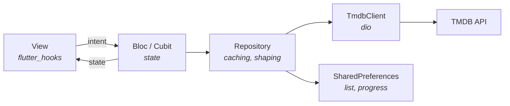

<div align="center">

# Freeplix

**One Flutter codebase. Web, iOS and Android.**

A complete streaming-catalogue interface — browse, filter, search, and track
what you're watching — built to show how far Flutter goes on the web without
giving up the phone.

[](https://iamnabink.github.io/Freeplix/)
[](https://flutter.dev)
[](#)
[](LICENSE)
[](https://github.com/iamnabink/Freeplix/stargazers)

### [→ Try it live](https://iamnabink.github.io/Freeplix/)

</div>

---

Freeplix is a real interface, not a widget gallery: a spotlight reel, filterable
catalogues of films and series, multi-search, season-by-season episode
listings, a local watchlist, and a player shell — all from one Dart codebase,
with no backend and no accounts.

It exists to be read. Every file is hand-written, nothing is code-generated,
and the architecture is deliberately plain: BLoC over repositories over the
TMDB API.

## Screenshots

One codebase, rendered by the same widgets on every target.

**Web**

| | |
| --- | --- |
|  |  |
|  |  |

**Phone**

Same codebase. Same widgets. One responsive layout that carries from a
desktop browser down to a phone — no parallel mobile build, no second design
to keep in sync.

> **Playback is web only for now.** On a phone the watch screen hands off to
> the system browser. Bringing it inline is open for a PR — see
> [Future work](#platform).

<p align="left">
  
  
</p>

## What it does

- **Home** — a spotlight reel of what's trending, then carousels for what's in
  theatres, what's on the air, and what's coming.
- **Browse** — the full TMDB catalogue for films and series, a page at a time
  behind a **Load more** button.
- **Search** — one debounced multi-search across films and series.
- **Details** — synopsis, cast, crew, certification, runtime, genres,
  season-by-season episode listings, and recommendations.
- **My list** — saved titles, kept in your browser's local storage.
- **Jump back in** — the home page offers back whatever you last opened in the
  player, down to the episode for a series. The player runs cross-origin so
  its position cannot be read; this records what was opened, not a percentage.
- **Filters** — the interesting ones. Browse by **keyword** ("heist", "time
  travel"), by **studio** (Ghibli, A24, Pixar), by **cast**, by what's
  **streaming** in your region, by runtime, language, country, decade or
  rating. Industry shorthands (Bollywood, Tollywood, K-drama, Anime) stand for
  a language and country pair, and one-tap presets sit on the page so the good
  filters aren't buried in a sheet.

  No "dubbed" filter: TMDB records a title's *original* language and silently
  ignores `with_spoken_language`, so there is no honest way to offer one.
- **Watch** — a 16:9 player stage fed by a playback source you configure
  yourself (see [Playback sources](#playback-sources)). Theater by default,
  with a wide toggle. Web only; mobile hands off to the system browser.
- **Trailer** — its own button and its own URL
  (`/watch/movie/603?trailer=1`). Watching the feature and watching the
  trailer are separate intents: asking for one never silently gives you the
  other. With no source configured, the player says so instead of quietly
  substituting a trailer.

Every screen has an address: `/title/movie/603`, `/series?genre=18`,
`/search?q=dune`. Paste a link and it opens where you left it.

## Worth reading in here

If you landed here to see how something is done, these are the files that
answer a real question rather than restating a tutorial.

| Question | Where |
| --- | --- |
| How do you embed a third-party player in Flutter web? | [`web_embed_web.dart`](lib/core/widgets/embed/web_embed_web.dart) — `dart:ui_web` platform views, with a stub sibling so the app still compiles for mobile |
| How do you keep URLs real on Flutter web? | [`url_strategy.dart`](lib/core/router/url_strategy.dart) — path URLs behind a conditional import, plus the `404.html` trick Pages needs |
| How do you keep one layout honest across widths? | [`app_shell.dart`](lib/shell/view/app_shell.dart) — the shell measures its own header and publishes it, so pages clear it instead of guessing |
| How do you build a filter that maps cleanly to an API? | [`media_filter.dart`](lib/data/models/media_filter.dart) — one immutable value object, one `toQuery`, fully unit tested |
| How do you keep a search box from hammering an API? | [`search_cubit.dart`](lib/features/search/bloc/search_cubit.dart) — debounce plus a request id, so a slow early response cannot overwrite a newer one |
| How do you draw something that is not a rectangle? | [`sprocket_rail.dart`](lib/core/widgets/sprocket_rail.dart) — the film perforations every carousel runs between |

A few decisions are deliberately *not* the obvious ones, and the comments say
why: watching and watching-a-trailer are separate intents rather than a
fallback, the carousel arrows are built only where a pointer exists, and the
service worker is switched off because a catalogue that always needs the
network gains nothing from it but a stale first paint.

## Playback sources

**Freeplix ships with no playback source, and none is hard-coded anywhere in
this repository.** Out of the box it reads its catalogue from TMDB and plays
the official trailers TMDB publishes; pressing **Watch** reports that no
source is configured rather than pretending otherwise.

Freeplix is a catalogue and a player shell. It does not host, index, or
distribute video, and it is not a way to watch films you do not have the right
to watch. If you are deploying it against a library you are licensed to
stream — your own media server, a licensed provider's embed API — point the
build at it with the `FREEPLIX_SOURCES` define:

```jsonc
[
  {
    "id": "library",
    "name": "My Library",
    "movie": "https://example.com/embed/movie/{tmdbId}",
    "tv": "https://example.com/embed/tv/{tmdbId}/{season}/{episode}"
  }
]
```

`{tmdbId}`, `{season}` and `{episode}` are substituted at play time. List more
than one and a switcher appears under the player, with the trailer alongside
them as a peer rather than a fallback. Whatever you point it
at is loaded in a sandboxed iframe with `allow-popups` and
`allow-top-navigation` withheld, so an embed cannot open windows or steer the
page out from under the reader.

Please check your own licensing position before configuring a source. Whoever
deploys the build is responsible for what it points at.

## Running it

Requires [FVM](https://fvm.app/) — the project is pinned to Flutter **3.44.8**.

```bash
fvm install
fvm flutter pub get

cp .env.example .env       # then paste in your TMDB key
fvm flutter run -d chrome --dart-define-from-file=.env
```

Get a TMDB key from your [API settings](https://www.themoviedb.org/settings/api).
The v4 read access token is preferred; the v3 key is a fallback.

> The key is compiled into the client bundle, as it is in any browser-only TMDB
> app — it is visible to anyone who opens devtools. Use a read-only key, and
> keep `.env` out of version control (it is already in `.gitignore`).

Build a release bundle:

```bash
fvm flutter build web --release \
  --base-href "/Freeplix/" \
  --dart-define-from-file=.env
```

## Built with

| | |
| --- | --- |
| **Flutter 3.44.8** | pinned with [FVM](https://fvm.app/) |
| **flutter_bloc** | state, one bloc or cubit per feature |
| **flutter_hooks** | views, without a `StatefulWidget` in sight |
| **go_router** | every screen has a real URL |
| **dio** | networking, with typed failures the UI can act on |
| **TMDB API** | the whole catalogue |
| **Very Good CLI** | scaffold and lints |

No code generation. No `build_runner`. Every file here was written by hand and
is meant to be read.

## Architecture

MVP with BLoC — a thin view layer over cubits and blocs, over repositories,
over the API.



Views hold no logic and no data; they read state and emit intent. Repositories
own caching and turn payloads into models. Nothing is code-generated.

```
lib/
  core/
    config/      build-time config and the playback source registry
    network/     Dio client and the errors the UI can act on
    router/      go_router — every screen has a URL
    theme/       colour, type, spacing and motion tokens
    widgets/     the shared kit: poster cards, carousels, states
  data/
    models/      TMDB payloads, parsed defensively
    repositories/ TMDB and the local watchlist
  features/
    home/ browse/ search/ details/ watch/ watchlist/
      bloc/      state
      view/      screens
      widgets/   parts that belong to one feature
  shell/         persistent navigation chrome
```

State lives in blocs and cubits; views are `flutter_hooks` widgets that read
state and emit intent. Networking is `dio`. Nothing is code-generated — every
file here is hand-written and readable.

Scaffolded with [Very Good CLI](https://cli.vgv.dev/).

## Design

The interface is built around a projection booth: the cool silver of a lit
screen in front of you, the warm tungsten of the lamp behind you, and the dark
of the room everywhere else. Carousels run between two strips of film
perforation and warm toward the lamp as you move through them.

Type is Bricolage Grotesque for display, Inter Tight for body, and Space Mono
for anything a projectionist would have written on the can — runtimes, years,
reel numbers. All three are bundled (SIL Open Font License; the licence texts
ship alongside them in `assets/fonts/`), so nothing is fetched from a font CDN
at runtime.

## Deployment

Releases are tag-driven. Nothing deploys on a push or a pull request:

```bash
git tag v1.0.2 && git push origin v1.0.2
```

`release.yaml` then runs `flutter analyze` and `flutter test`, builds the web
bundle, attaches it to a GitHub Release as a zip, and publishes it to Pages.

Repository secrets, under **Settings → Secrets and variables → Actions**:

| Secret | Required | Purpose |
| --- | --- | --- |
| `TMDB_API_READ_ACCESS_TOKEN` | yes | TMDB v4 read token |
| `TMDB_API_KEY` | fallback | TMDB v3 key |
| `FREEPLIX_SOURCES` | yes | JSON array of playback sources |

> The TMDB key is compiled into the published bundle and is readable by anyone
> who opens devtools. A repository secret keeps it out of the source and the
> build logs, but it cannot keep it out of the artifact — the browser needs the
> key to call TMDB directly. This is inherent to every backend-less client, so
> use a read-only key and rotate it if it is ever abused.

Two pieces of one-time setup that the workflow token cannot do for itself:

- **Enable Pages.** `GITHUB_TOKEN` is not allowed to create a Pages site, so
  `enablement: true` fails on a repo that has never had Pages. Turn it on once
  under **Settings → Pages → Source: GitHub Actions**.
- **Allow tag deploys.** The `github-pages` environment only accepts
  deployments from branches by default, so a `v*` tag is rejected. Add a
  deployment branch policy for the `v*` **tag** under
  **Settings → Environments → github-pages**.

Because Pages has no SPA rewrite, the build copies `index.html` to `404.html`.
Deep links return a 404 *status* while serving the app, which is what lets
`/title/movie/603` resolve instead of hitting a Pages error page.

## Tests

```bash
fvm flutter test
```

61 tests covering the models, blocs, cubits, the filter-to-TMDB query mapping
and the playback source registry. `flutter analyze` runs clean under
`very_good_analysis` and `bloc_lint`.

There is deliberately no coverage badge. Releases are the only workflow, so
nothing publishes a coverage figure on every push — a committed badge would
be stale the moment it was generated. The number that would matter here is
widget coverage, and it is honestly low: every bug that reached the browser
was a layout bug, which is what [Future work](#testing) proposes fixing with
golden tests rather than a percentage.

## Future work

Freeplix releases to the web only. The iOS and Android projects exist and
compile, but nothing ships them — `release.yaml` builds `flutter build web`
and nothing else.

### Features

- **Person pages** — tap a cast member for their filmography
- **Where to watch** — TMDB exposes `/watch/providers`, which reports the
  licensed services carrying a title in a given region. A "available on…"
  row would be the catalogue's natural completion
- **Search upgrades** — recent searches, and keyboard navigation through
  results so the whole app is reachable without a pointer
- **More locales** — `l10n` is wired, only English and Spanish are filled in

### Platform

- **Mobile releases** — iOS (Swift Package Manager is already enabled) and
  Android. `release.yaml` builds web only, so mobile has no delivery path yet
- **In-app playback on mobile** — the player is web-only; other platforms hand
  off to the system browser. `flutter_inappwebview` would keep playback inline
  *and* allow intercepting navigation, which a bare frame cannot do. Worth
  doing only once mobile actually ships

### Infrastructure

- **A TMDB proxy** — the only way to stop the API key shipping inside the
  client bundle. A Cloudflare Worker holding the key, with Freeplix pointed at
  it instead of `api.themoviedb.org`, is roughly twenty lines. The cost is no
  longer being purely static
- **Cache headers** — GitHub Pages pins `max-age=600` and cannot be
  configured. Cloudflare in front of Pages would allow proper cache control,
  and pairs naturally with the proxy above
- **Response caching** — a `dio` cache interceptor would spare TMDB repeat
  requests for the same rails on every visit

### Testing

- **Golden and widget tests for layout** — the bugs that reached the browser
  were all layout, not logic: a fixed-height banner that overflowed on a
  phone, a header that collided with page headings, hidden controls that still
  occupied width. Unit tests could not have caught any of them; golden tests
  at two or three widths would have

## Contributing

PRs welcome, and the issues below are genuinely open rather than decoration.

**Good first contributions**

- **Inline playback on mobile** — the watch screen currently hands off to the
  system browser. `flutter_inappwebview` would keep it inline *and* allow
  intercepting navigation, which a bare frame cannot. See
  [`watch_page.dart`](lib/features/watch/view/watch_page.dart)
- **Person pages** — the cast filter already resolves people; tapping a cast
  member could open their filmography using the same `with_cast` machinery
- **Golden tests** — every bug that reached the browser here was a layout bug
  at a width nobody checked. Goldens at three widths would have caught them
  all, and unit tests structurally cannot
- **Locales** — `l10n` is wired and only English and Spanish are filled in

**Ground rules**

`flutter analyze` runs clean under `very_good_analysis` and `bloc_lint`, and
the tests pass, before anything merges:

```bash
fvm flutter analyze && fvm flutter test
```

CI runs the same checks plus `dart format` and a web build on every pull
request. `main` takes changes through pull requests only.

Views stay logic-free, repositories own caching, and nothing is
code-generated. If a decision is not the obvious one, leave a comment saying
why — there are several of those already, and they are the most useful lines
in the codebase.

## Licence and attribution

Freeplix is released under the [MIT licence](LICENSE), for educational use.

This product uses the TMDB API but is not endorsed or certified by TMDB. All
metadata and artwork belong to TMDB and its contributors, under
[TMDB's terms of use](https://www.themoviedb.org/terms-of-use).
